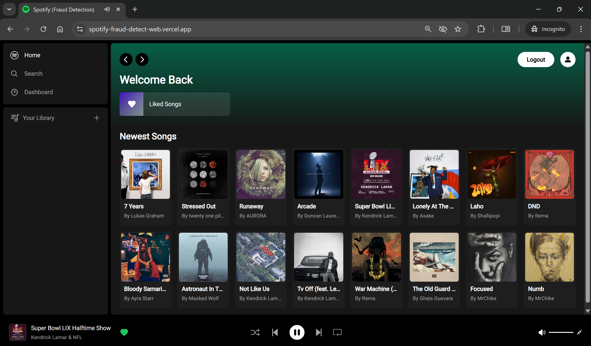

# Full Stack Spotify Clone with Next.js 13.4 App Router: React, Tailwind, Supabase, PostgreSQL, Stripe & TypeScript

Tutorial Followed: [Code With Antonio - Full Stack Spotify Clone](https://youtu.be/2aeMRB8LL4o)
<br>
Instructor: [Antonio Erdeljac](https://github.com/antonioerdeljac)




Key Features:

- Song upload
- Stripe integration
- Tailwind design for sleek UI
- Tailwind animations and transition effects
- Full responsiveness for all devices
- Credential authentication with Supabase
- Github authentication integration
- File and image upload using Supabase storage
- Client form validation and handling using react-hook-form
- Server error handling with react-toast
- Play song audio
- Favorites system
- Playlists / Liked songs system
- Advanced Player component
- Stripe recurring payment integration
- POST, GET, and DELETE routes in route handlers (app/api)
- Fetch data in server React components by directly accessing the database
- Handling relations between Server and Child components in a real-time environment
- Cancelling Stripe subscriptions

### Prerequisites

**Node version 14.x**

### Cloning the repository

```shell
git clone https://github.com/MrChike/SpotifyFraudDetectWeb.git
```

### Install packages

```shell
npm install
```

### Setup .env File

```js
NEXT_PUBLIC_SUPABASE_URL=
NEXT_PUBLIC_SUPABASE_ANON_KEY=
SUPABASE_SERVICE_ROLE_KEY=

NEXT_PUBLIC_STRIPE_PUBLISHABLE_KEY=
STRIPE_SECRET_KEY=
STRIPE_WEBHOOK_SECRET=
```

### Add SQL Tables

Copy the sql commands found in `database.sql` file to create songs and liked_songs table in Supabase sql cli interface. `https://supabase.com/`

## Access supabase via command line
```shell
npx supabase login
npx supabase gen types typescript --project-id [Your Supabase Project ID] --schema public > database.types.ts
```

### Start the App

```shell
npm run dev
```

## Available commands

Running commands with npm `npm run [command]`

| command         | description                                         |
| :-------------- | :-------------------------------------------------- |
| `dev`           | Starts a development instance of the app            |
| `build`         | Starts a building final version for production      |
| `start`         | Run final production build version                  |
| `lint`          | Run lint check as configured in .eslintrc.json file |
